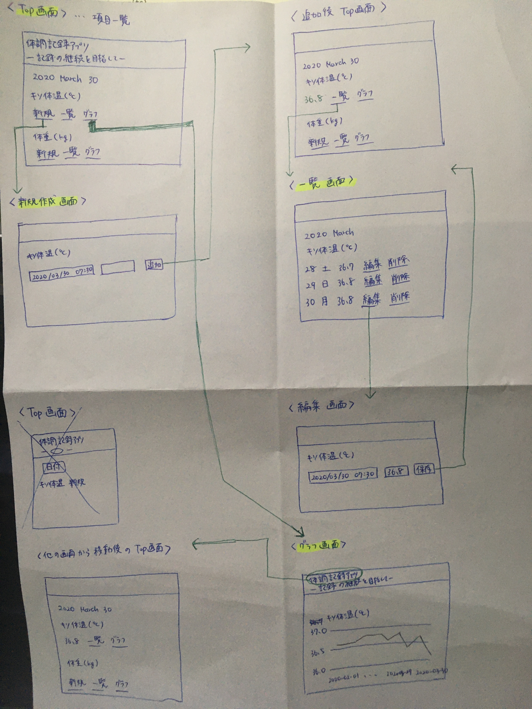

# 体調記録アプリ

## 背景

* 現在、体調記録アプリを3、4つ併用している。各アプリで使いたい機能がばらついてるためそれを統一して1個のアプリに集約したい。分散しているせいで記録が面倒なのでそれを解決したい。

## 欲しい機能

* データ保存に趣を置く。新規作成、削除、一覧表示
    * すばやい起動時間、生理周期自動計算、生理予測、カレンダー、時間毎の記録、
    * 自動保存、グラフ(5〜10年くらいが理想/ 各項目ごとに縦横軸の単位変更可能)、各項目のグラフを一つのグラフにまとめて表示
    * 種類豊富なアイコン 

## 開発

* 必要なもの
    * Ruby >= v2.6.x
    
```sh
git clone https://github.com/maiamea/health_record_basal_body_temperature_api.git
cd health_record_basal_body_temperature_api

# Ruby のライブラリをインストール
bundle install

# 開発用DB (SQLite3)を用意
bin/rails db:migrate

# Rails のサーバーを起動
bin/rails server

```

## メモ
* サーバー側とフロント側を分離し、サーバーからWebAPIを返すことで、クライアント側でデータを扱いやすくした
* クライアント側のソースコードはこちら https://github.com/maiamea/health_record_vue_app
* 現在実装中の機能
    * 基礎体温
        * 新規作成画面
        * 測定値一覧
        * 測定値の削除機能
        * グラフ表示
* まずは機能実装を優先、CSSは後で調整する
* 設計メモ
    
